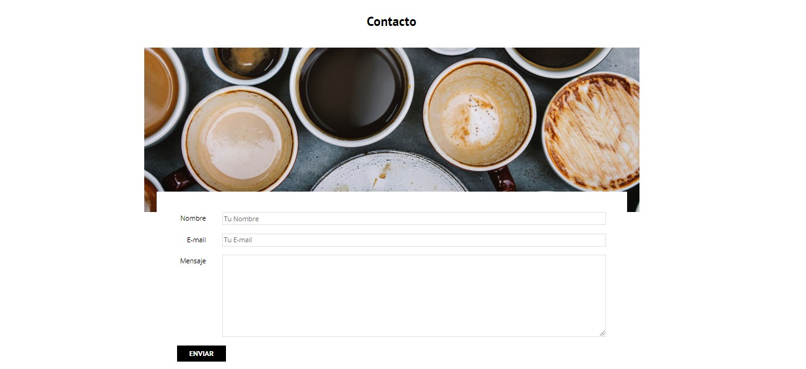

<h1>Página Web BlogCafé</h1>

 

 
Esta página fue construida siguiendo el curso Udemy "Desarrollo Web Completo con HTML5, CSS3, JS AJAX PHP y MySQL" de Juan Pablo De la torre Valdez (https://www.udemy.com/course/desarrollo-web-completo-con-html5-css3-js-php-y-mysql/).
En este, se crean cinco páginas distintas utilizando HTML5 y CSS3. 
Es importante destacar que el formulario de contacto de este no es válido

 

